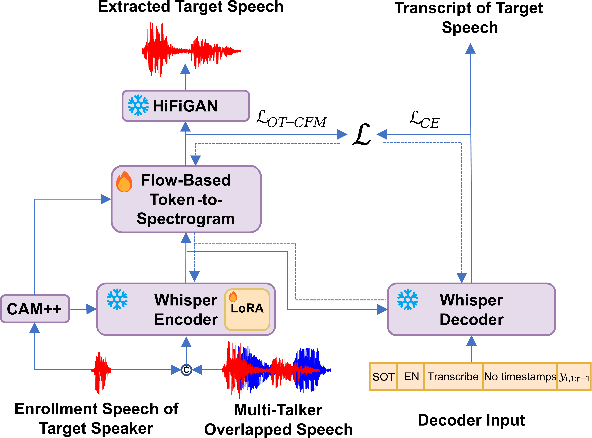

# Enhancing Intelligibility for Generative Target Speech Extraction via Joint Optimization with Target Speaker ASR

This is the demonstration page of the paper "Enhancing Intelligibility for Generative Target Speech Extraction via Joint Optimization with Target Speaker ASR" with samples generated with the proposed method and some other baseline methods.

[](https://arxiv.org/)
<!-- [](https://github.com/Aisaka0v0/CLAPSep)
[](https://huggingface.co/spaces/AisakaMikoto/CLAPSep) -->

<div align="center">
  
</div>

## Abstract

Target speech extraction (TSE) isolates speech for a specific speaker within the multi-talker overlapped speech mixture. Most existing TSE models are based on discriminative methods, which always predict a time-frequency spectrogram mask for the target speech. However, imperfections in the mask often lead to over-/under-suppression of target/non-target speech, degrading perceptual quality. Generative methods, on the other hand, re-synthesize target speech based on the mixture and target speaker cues, achieving superior perceptual quality. However, these methods often neglect speech intelligibility, causing changes or loss of semantic content in the re-synthesized speech. Inspired by the Whisper model's success in target speaker ASR, we propose a generative target speech extraction framework based on the pre-trained Whisper model, integrating semantic modeling with flow-based acoustic modeling for both high intelligibility and perceptual quality. Results on multiple evaluation benchmarks show the proposed method outperforms existing generative and discriminative baselines.


## Demos

We provide demonstration on speech samples from Libri2Mix and WSJ0-2mix.
## Speech samples from Libri2Mix

<table style="margin: 0 auto;">
  <thead>
    <tr>
      <th>Unprocessed</th>
      <th>Enrollment</th>
      <th>Ours Generative</th>
      <th>Discriminative Baseline</th> 
      <th>Ground Truth</th>      
    </tr>
  </thead>
  <tbody>
    <tr>
      <td colspan="5">Text: THIS WAS SO SWEET A LADY SIR AND IN SOME MANNER I DO THINK SHE DIED</td>
    </tr>
    <tr>
      <td><html><audio controls style="width: 200px;"><source src="demo/librimix/mixture/61-70968-0005_5105-28233-0000.wav"></audio></html></td>
      <td><html><audio controls style="width: 200px;"><source src="demo/librimix/query/61.wav"></audio></html></td>
      <td><html><audio controls style="width: 200px;"><source src="demo/librimix/ours/61-70968-0005_5105-28233-0000_s1.wav"></audio></html></td>
      <td><html><audio controls style="width: 200px;"><source src="demo/librimix/baseline/61-70968-0005_5105-28233-0000_s1.wav"></audio></html></td>
      <td><html><audio controls style="width: 200px;"><source src="demo/librimix/target/61-70968-0005_5105-28233-0000_s1.wav"></audio></html></td>
    </tr>
    <tr>
      <td colspan="5">Text: LENGTH OF SERVICE FOURTEEN YEARS THREE MONTHS AND FIVE DAYS</td>
    </tr>
    <tr>
      <td><html><audio controls style="width: 200px;"><source src="demo/librimix/mixture/61-70968-0005_5105-28233-0000.wav"></audio></html></td>
      <td><html><audio controls style="width: 200px;"><source src="demo/librimix/query/5105.wav"></audio></html></td>
      <td><html><audio controls style="width: 200px;"><source src="demo/librimix/ours/61-70968-0005_5105-28233-0000_s2.wav"></audio></html></td>
      <td><html><audio controls style="width: 200px;"><source src="demo/librimix/baseline/61-70968-0005_5105-28233-0000_s2.wav"></audio></html></td>
      <td><html><audio controls style="width: 200px;"><source src="demo/librimix/target/61-70968-0005_5105-28233-0000_s2.wav"></audio></html></td>
    </tr>
    <tr>
      <td colspan="5">Text: IN EIGHTEEN SIXTY TWO A LAW WAS ENACTED WITH THE PURPOSE OF SUPPRESSING PLURAL MARRIAGE AND AS HAD BEEN PREDICTED IN THE NATIONAL SENATE PRIOR TO ITS PASSAGE IT LAY FOR MANY YEARS A DEAD LETTER</td>
    </tr>
    <tr>
      <td><html><audio controls style="width: 200px;"><source src="demo/librimix/mixture/4077-13754-0010_4507-16021-0010.wav"></audio></html></td>
      <td><html><audio controls style="width: 200px;"><source src="demo/librimix/query/4077.wav"></audio></html></td>
      <td><html><audio controls style="width: 200px;"><source src="demo/librimix/ours/4077-13754-0010_4507-16021-0010_s1.wav"></audio></html></td>
      <td><html><audio controls style="width: 200px;"><source src="demo/librimix/baseline/4077-13754-0010_4507-16021-0010_s1.wav"></audio></html></td>
      <td><html><audio controls style="width: 200px;"><source src="demo/librimix/target/4077-13754-0010_4507-16021-0010_s1.wav"></audio></html></td>
    </tr>
    <tr>
      <td colspan="5">Text: WE HAVE ALWAYS THOUGHT THAT IT WAS SOMETIMES A COURAGEOUS ACT AND AT LEAST A SIMPLE AND USEFUL DEED WORTHY OF THE SYMPATHETIC ATTENTION WHICH DUTY ACCEPTED AND FULFILLED MERITS</td>
    </tr>
    <tr>
      <td><html><audio controls style="width: 200px;"><source src="demo/librimix/mixture/4077-13754-0010_4507-16021-0010.wav"></audio></html></td>
      <td><html><audio controls style="width: 200px;"><source src="demo/librimix/query/4507.wav"></audio></html></td>
      <td><html><audio controls style="width: 200px;"><source src="demo/librimix/ours/4077-13754-0010_4507-16021-0010_s2.wav"></audio></html></td>
      <td><html><audio controls style="width: 200px;"><source src="demo/librimix/baseline/4077-13754-0010_4507-16021-0010_s2.wav"></audio></html></td>
      <td><html><audio controls style="width: 200px;"><source src="demo/librimix/target/4077-13754-0010_4507-16021-0010_s2.wav"></audio></html></td>
    </tr>
    <tr>
      <td colspan="5">Text: HIS HOUSEKEEPER HAD THE MANAGEMENT OF EVERYTHING SHE NEVER ALLOWED HIM TO BE IN NEED OF ANYTHING AND SHE GAVE NO ACCOUNT OF HIS MONEY WHICH SHE KEPT ALTOGETHER BECAUSE HE NEVER ASKED HER TO RENDER ANY ACCOUNTS</td>
    </tr>
    <tr>
      <td><html><audio controls style="width: 200px;"><source src="demo/librimix/mixture/3729-6852-0046_672-122797-0044.wav"></audio></html></td>
      <td><html><audio controls style="width: 200px;"><source src="demo/librimix/query/3729.wav"></audio></html></td>
      <td><html><audio controls style="width: 200px;"><source src="demo/librimix/ours/3729-6852-0046_672-122797-0044_s1.wav"></audio></html></td>
      <td><html><audio controls style="width: 200px;"><source src="demo/librimix/baseline/3729-6852-0046_672-122797-0044_s1.wav"></audio></html></td>
      <td><html><audio controls style="width: 200px;"><source src="demo/librimix/target/3729-6852-0046_672-122797-0044_s1.wav"></audio></html></td>
    </tr>
    <tr>
      <td colspan="5">Text: AND HE LEANED AGAINST THE WALL LOST IN REVERIE</td>
    </tr>
    <tr>
      <td><html><audio controls style="width: 200px;"><source src="demo/librimix/mixture/3729-6852-0046_672-122797-0044.wav"></audio></html></td>
      <td><html><audio controls style="width: 200px;"><source src="demo/librimix/query/672.wav"></audio></html></td>
      <td><html><audio controls style="width: 200px;"><source src="demo/librimix/ours/3729-6852-0046_672-122797-0044_s2.wav"></audio></html></td>
      <td><html><audio controls style="width: 200px;"><source src="demo/librimix/baseline/3729-6852-0046_672-122797-0044_s2.wav"></audio></html></td>
      <td><html><audio controls style="width: 200px;"><source src="demo/librimix/target/3729-6852-0046_672-122797-0044_s2.wav"></audio></html></td>
    </tr>

    
  </tbody>
</table>


## Speech samples from WSJ0-2mix


<table style="margin: 0 auto;">
  <thead>
    <tr>
      <th>Unprocessed</th>
      <th>Enrollment</th>
      <th>Ours Generative</th>
      <th>Discriminative Baseline</th> 
      <th>Ground Truth</th>      
    </tr>
  </thead>
  <tbody>
    <tr>
      <td colspan="5">Text: When the federal pension insurer stepped in this fund had just seven thousand seven hundred dollars in it to meet two hundred thirty million dollars in obligations</td>
    </tr>
    <tr>
      <td><html><audio controls style="width: 200px;"><source src="demo/wsj/mixture/051c010j_2.4_421c020p_-2.4_051a050x.wav"></audio></html></td>
      <td><html><audio controls style="width: 200px;"><source src="demo/wsj/query/051c010j_2.4_421c020p_-2.4_051a050x.wav"></audio></html></td>
      <td><html><audio controls style="width: 200px;"><source src="demo/wsj/ours/051c010j_2.4_421c020p_-2.4_051a050x.wav"></audio></html></td>
      <td><html><audio controls style="width: 200px;"><source src="demo/wsj/baseline/051c010j_2.4_421c020p_-2.4_051a050x.wav"></audio></html></td>
      <td><html><audio controls style="width: 200px;"><source src="demo/wsj/target/051c010j_2.4_421c020p_-2.4_051a050x.wav"></audio></html></td>
    </tr>
    <tr>
      <td colspan="5">Text: Most European traders were reportedly staying out of action until the trade figures are released</td>
    </tr>
    <tr>
      <td><html><audio controls style="width: 200px;"><source src="demo/wsj/mixture/420c020k_0.1_421o0303_-0.1_420o030l.wav"></audio></html></td>
      <td><html><audio controls style="width: 200px;"><source src="demo/wsj/query/420c020k_0.1_421o0303_-0.1_420o030l.wav"></audio></html></td>
      <td><html><audio controls style="width: 200px;"><source src="demo/wsj/ours/420c020k_0.1_421o0303_-0.1_420o030l.wav"></audio></html></td>
      <td><html><audio controls style="width: 200px;"><source src="demo/wsj/baseline/420c020k_0.1_421o0303_-0.1_420o030l.wav"></audio></html></td>
      <td><html><audio controls style="width: 200px;"><source src="demo/wsj/target/420c020k_0.1_421o0303_-0.1_420o030l.wav"></audio></html></td>
    </tr>
    <tr>
      <td colspan="5">Text: R\. L\. I\. Corporation a Peoria Illinois based insurance holding company will begin trading Friday on the Big Board under the symbol R\. L\. I\.</td>
    </tr>
    <tr>
      <td><html><audio controls style="width: 200px;"><source src="demo/wsj/mixture/440c0204_1.5_22ha010r_-1.5_440o0303.wav"></audio></html></td>
      <td><html><audio controls style="width: 200px;"><source src="demo/wsj/query/440c0204_1.5_22ha010r_-1.5_440o0303.wav"></audio></html></td>
      <td><html><audio controls style="width: 200px;"><source src="demo/wsj/ours/440c0204_1.5_22ha010r_-1.5_440o0303.wav"></audio></html></td>
      <td><html><audio controls style="width: 200px;"><source src="demo/wsj/baseline/440c0204_1.5_22ha010r_-1.5_440o0303.wav"></audio></html></td>
      <td><html><audio controls style="width: 200px;"><source src="demo/wsj/target/440c0204_1.5_22ha010r_-1.5_440o0303.wav"></audio></html></td>
    </tr>
    <tr>
      <td colspan="5">Text: In certain cases \,COMMA the cards are given free to subscribers \.PERIOD</td>
    </tr>
    <tr>
      <td><html><audio controls style="width: 200px;"><source src="demo/wsj/mixture/440o0311_0.5_423c0205_-0.5_440c020q.wav"></audio></html></td>
      <td><html><audio controls style="width: 200px;"><source src="demo/wsj/query/440o0311_0.5_423c0205_-0.5_440c020q.wav"></audio></html></td>
      <td><html><audio controls style="width: 200px;"><source src="demo/wsj/ours/440o0311_0.5_423c0205_-0.5_440c020q.wav"></audio></html></td>
      <td><html><audio controls style="width: 200px;"><source src="demo/wsj/baseline/440o0311_0.5_423c0205_-0.5_440c020q.wav"></audio></html></td>
      <td><html><audio controls style="width: 200px;"><source src="demo/wsj/target/440o0311_0.5_423c0205_-0.5_440c020q.wav"></audio></html></td>
    </tr>
    <tr>
      <td colspan="5">Text: Accepted bids ranged from six point two percent to six point two two five percent</td>
    </tr>
    <tr>
      <td><html><audio controls style="width: 200px;"><source src="demo/wsj/mixture/442c0202_0.4_423a010v_-0.4_442c020m.wav"></audio></html></td>
      <td><html><audio controls style="width: 200px;"><source src="demo/wsj/query/442c0202_0.4_423a010v_-0.4_442c020m.wav"></audio></html></td>
      <td><html><audio controls style="width: 200px;"><source src="demo/wsj/ours/442c0202_0.4_423a010v_-0.4_442c020m.wav"></audio></html></td>
      <td><html><audio controls style="width: 200px;"><source src="demo/wsj/baseline/442c0202_0.4_423a010v_-0.4_442c020m.wav"></audio></html></td>
      <td><html><audio controls style="width: 200px;"><source src="demo/wsj/target/442c0202_0.4_423a010v_-0.4_442c020m.wav"></audio></html></td>
    </tr>
    <tr>
      <td colspan="5">Text: [tongue_click] [loud_breath] No one at the State Department wants to let spies in</td>
    </tr>
    <tr>
      <td><html><audio controls style="width: 200px;"><source src="demo/wsj/mixture/445c0205_0.6_421o030e_-0.6_445c020s.wav"></audio></html></td>
      <td><html><audio controls style="width: 200px;"><source src="demo/wsj/query/445c0205_0.6_421o030e_-0.6_445c020s.wav"></audio></html></td>
      <td><html><audio controls style="width: 200px;"><source src="demo/wsj/ours/445c0205_0.6_421o030e_-0.6_445c020s.wav"></audio></html></td>
      <td><html><audio controls style="width: 200px;"><source src="demo/wsj/baseline/445c0205_0.6_421o030e_-0.6_445c020s.wav"></audio></html></td>
      <td><html><audio controls style="width: 200px;"><source src="demo/wsj/target/445c0205_0.6_421o030e_-0.6_445c020s.wav"></audio></html></td>
    </tr>

    
  </tbody>
</table>


<!-- ## Citation
```
@article{ma2024clapsep,
  title={CLAPSep: Leveraging Contrastive Pre-trained Models for Multi-Modal Query-Conditioned Target Sound Extraction},
  author={Ma, Hao and Peng, Zhiyuan and Li, Xu and Shao, Mingjie and Wu, Xixin and Liu, Ju},
  journal={arXiv preprint arXiv:2402.17455},
  year={2024}
}
``` -->
